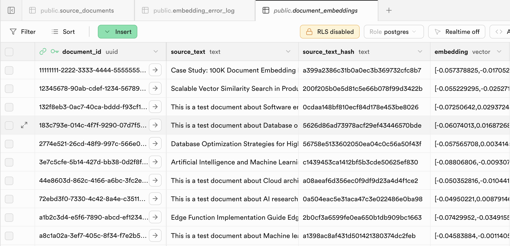

# Architecture Overview

This document describes the technical architecture of the Supabase Sidecar Embedding Engine, a system for processing document embeddings using PostgreSQL extensions and Edge Functions.

## System Architecture



### High-Level Overview


### Database Schema


## Component Details

### 1. Source Documents Table

The main table storing document content with optimized indexes:

- **Primary Key**: UUID for unique identification
- **Content**: Text field for embedding generation
- **Metadata**: JSONB for flexible document attributes
- **Timestamps**: Automatic creation and update tracking
- **Indexes**: Optimized for fast queries and full-text search

### 2. Embeddings Sidecar Table

Separate table for vector storage to prevent performance degradation:

- **Foreign Key**: Links to source documents
- **Source Text**: Original content for change detection
- **Hash**: MD5 hash for efficient change detection
- **Vector**: 384-dimensional embeddings from gte-small model
- **Indexes**: Specialized vector indexes for similarity search

### 3. Queue System

PostgreSQL-based job queue using `pgmq` extension:

- **Job Storage**: Persistent queue within database
- **Message Format**: JSON with document ID and action
- **Triggers**: Automatic job creation on document changes
- **Processing**: Background processing via cron jobs

### 4. Autonomous Processing

Scheduled processing using `pg_cron` extension:

- **Change Detection**: Hash-based content comparison
- **Scheduling**: Configurable cron intervals
- **Batch Processing**: Configurable batch sizes
- **Error Handling**: Automatic retry and logging

### 5. Edge Function Processing

Serverless embedding generation:

- **Model**: Supabase AI with gte-small
- **Input**: Document content from queue
- **Output**: 384-dimensional vectors
- **Processing**: Batch processing with configurable sizes
- **Error Handling**: Comprehensive error handling and logging

## Data Flow

### Document Creation Flow


### Re-embedding Flow


## Performance Characteristics


### Processing Metrics

- **Batch Sizes**: Configurable from 1 to larger batches
- **Processing Rate**: Varies based on document complexity
- **Memory Usage**: Optimized for Edge Function limits
- **Error Handling**: Automatic retry with exponential backoff

### Scalability Features

- **Sidecar Pattern**: Prevents main table performance degradation
- **Queue Processing**: Handles burst loads gracefully
- **Autonomous Operation**: Continuous processing without intervention
- **Resource Optimization**: CPU-aware processing limits

## Security Considerations

### Authentication

- **Service Role**: Secure JWT storage in Supabase Vault
- **Permissions**: Minimal required permissions for cron jobs
- **API Access**: Authenticated Edge Function calls

### Data Protection

- **Row Level Security**: Configurable access controls
- **Input Validation**: Content sanitization and validation
- **Error Logging**: Secure error handling without data exposure

## Monitoring and Observability


### System Health

- **Queue Status**: Real-time queue depth monitoring
- **Processing Metrics**: Success rates and error counts
- **Performance Data**: Execution times and resource usage
- **Error Tracking**: Comprehensive error logging and analysis

### Operational Metrics

- **Throughput**: Documents processed per time period
- **Latency**: End-to-end processing times
- **Reliability**: Success rates and error patterns
- **Resource Usage**: Memory and CPU consumption

## Configuration

### Environment Variables

- **Batch Sizes**: Configurable processing batch sizes
- **Model Selection**: AI model configuration
- **Queue Settings**: Processing intervals and limits
- **Error Handling**: Retry logic and timeout settings

### Database Settings

- **Extensions**: Required PostgreSQL extensions
- **Indexes**: Performance optimization settings
- **Triggers**: Automatic job queuing configuration
- **Cron Jobs**: Scheduling and execution settings

## Deployment

### Prerequisites

- Supabase project with required extensions
- PostgreSQL with pgvector, pgmq, pg_cron, pg_net
- Edge Function runtime environment
- Proper permissions and role configuration

### Setup Steps

1. **Database Schema**: Apply migration files in order
2. **Edge Functions**: Deploy processing functions
3. **Configuration**: Set environment variables and cron jobs
4. **Testing**: Verify system operation with sample data
5. **Monitoring**: Set up operational monitoring and alerting

## Troubleshooting


### Common Issues

- **Permission Errors**: Check role permissions for cron jobs
- **Queue Processing**: Verify cron job scheduling and execution
- **Edge Function Failures**: Check authentication and configuration
- **Performance Issues**: Monitor batch sizes and resource usage

### Debug Commands

```sql
-- Check cron job status
SELECT * FROM cron.job;

-- Monitor queue status
SELECT * FROM pgmq.get_batch('embedding_queue', 10);

-- Check function execution
SELECT * FROM pg_stat_statements WHERE query LIKE '%call_embedding_edge_function%';
```

## Future Enhancements

### Potential Improvements

- **Priority Queues**: Different processing priorities for document types
- **Multi-Model Support**: Configurable embedding models
- **Advanced Monitoring**: Enhanced metrics and alerting
- **Performance Optimization**: Further batch processing improvements
- **Error Recovery**: Enhanced retry logic and dead letter queues

### Production Hardening

- **Poison Pill Detection**: Implement retry limits and dead letter queue for jobs that consistently fail
- **Circuit Breaker Pattern**: Prevent cascade failures by temporarily disabling problematic processing paths
- **Advanced Retry Strategies**: Exponential backoff and jitter for transient failures
- **Resource Isolation**: Separate processing queues for different document types to prevent cross-contamination
